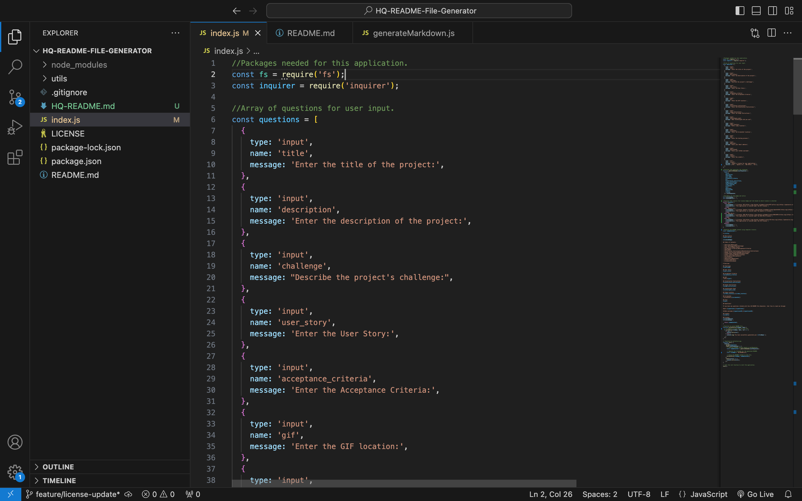
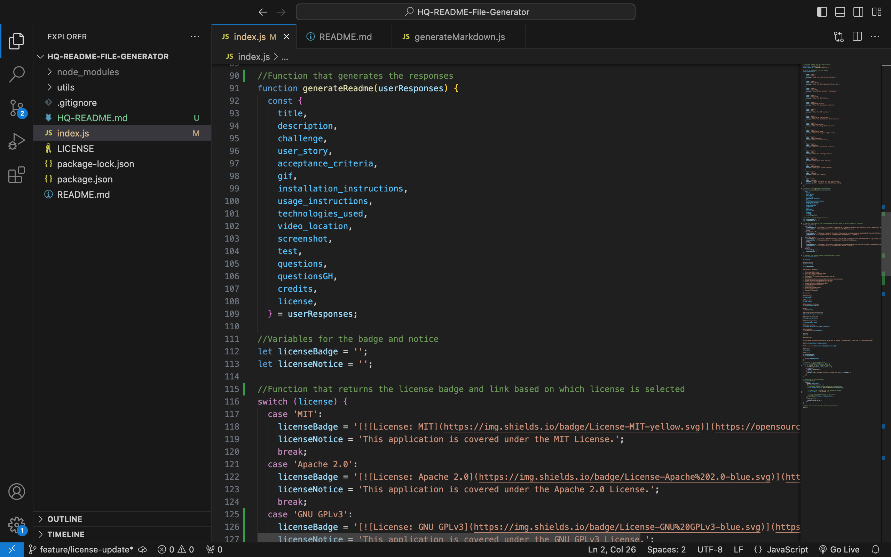
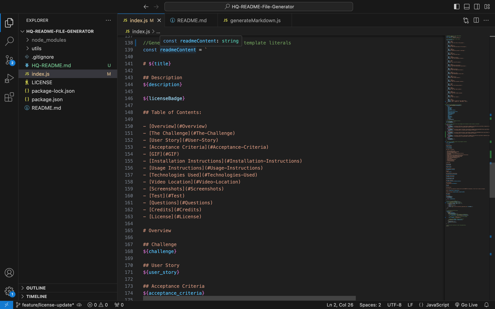
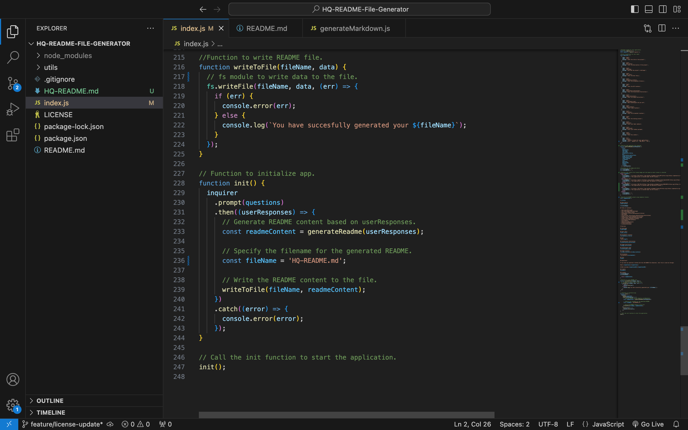
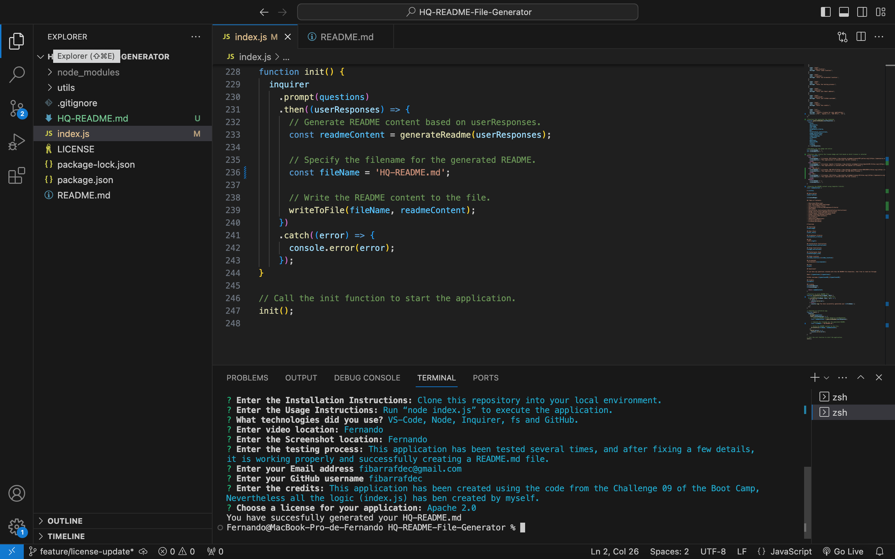

# HQ README File Generator

## Description
This application allows the user to create a high quality README file, for any project o repository, after answering a series of questions that ask the user to give the information needed to the README file.

## Table of Contents:

- [Overview](#Overview)
- [The Challenge](#The-Challenge)
- [User Story](#User-Story)
- [Acceptance Criteria](#Acceptance-Criteria)
- [GIF](#GIF)
- [Installation Instructions](#Installation-Instructions)
- [Usage Instructions](#Usage-Instructions)
- [Technologies Used](#Technologies-Used)
- [Video Location](#Video-Location)
- [Screenshots](#Screenshots)
- [Test](#Test)
- [Questions](#Questions)
- [Credits](#Credits)
- [License](#License)

# Overview

## Challenge
In order to reach the goal for this project, I have used: Node, inquirer and fs to run the application, prompt all the questions, retrieve the information needed, and generate the new file (HQ-README-md). Also, I added a menu of different choices from where the user can choose the license for the project.

## User Story
AS A developer, I WANT a README generator, SO THAT I can quickly create a professional README for a new project.

## Acceptance Criteria
GIVEN a command-line application that accepts user input, 
WHEN I am prompted for information about my application repository, 
THEN a high-quality, professional README.md is generated with the title of my project and sections entitled Description, Table of Contents, Installation, Usage, License, Contributing, Tests, and Questions, 
WHEN I enter my project title, 
THEN this is displayed as the title of the README, 
WHEN I enter a description, installation instructions, usage information, contribution guidelines, and test instructions, 
THEN this information is added to the sections of the README entitled Description, Installation, Usage, Contributing, and Tests, 
WHEN I choose a license for my application from a list of options, 
THEN a badge for that license is added near the top of the README and a notice is added to the section of the README entitled License that explains which license the application is covered under, 
WHEN I enter my GitHub username, 
THEN this is added to the section of the README entitled Questions, with a link to my GitHub profile, 
WHEN, I enter my email address, 
THEN this is added to the section of the README entitled Questions, with instructions on how to reach me with additional questions, 
WHEN I click on the links in the Table of Contents, 
THEN I am taken to the corresponding section of the README.

## Installation Instructions
1. Clone this repository into your local environment,  
2. Navigate using the command line into the directory with the index.js file, 
3. Run “npm init -y”, 
4. Check if inquirer 8.2.4 is in the dependencies inside the file package.json, if not, run “npm install inquirer@8.4.2”.

## Usage Instructions
1. Run “node index.js” to execute the application, 
2. Answer in detail every question prompted, 
3. Select the License covering your repository, 
4. Copy and paste the content of HQ-README.md” into your README file in the repository your are developing your new project.

## Technologies Used
VS-Code, Node, Inquirer, fs and GitHub.

## Video Location
[HQ README File Generator Video](https://drive.google.com/file/d/1SEJlra7sJ9Z7gfiTBWzUGRB18XVbxTW8/view?usp=drive_link)

## Screenshot

## Test
This application has been tested several times, and after fixing a few details, it is working properly and successfully creating a README.md file.

## Questions?

If you have any questions related with this HQ README File Generator, feel free to reach me through:

Email:[fibarrafdec@gmail.com](fibarrafdec@gmail.com)

GitHub username:[fibarrafdec](fibarrafdec)

## Credits
This application has been created using the code from the Challenge 09 of the Boot Camp, Nevertheless all the logic (index.js) has ben created by myself.

## License
This application is covered under the MIT License.
